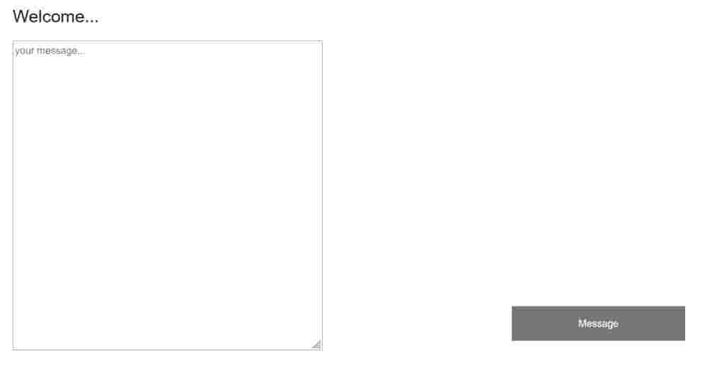
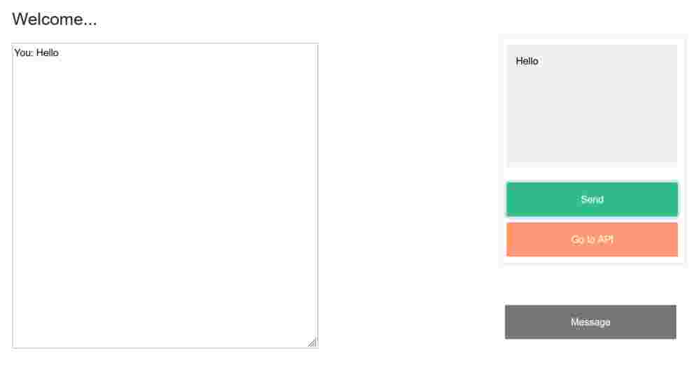
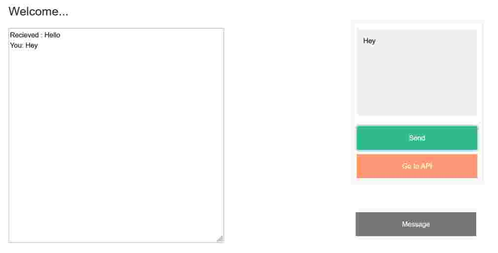
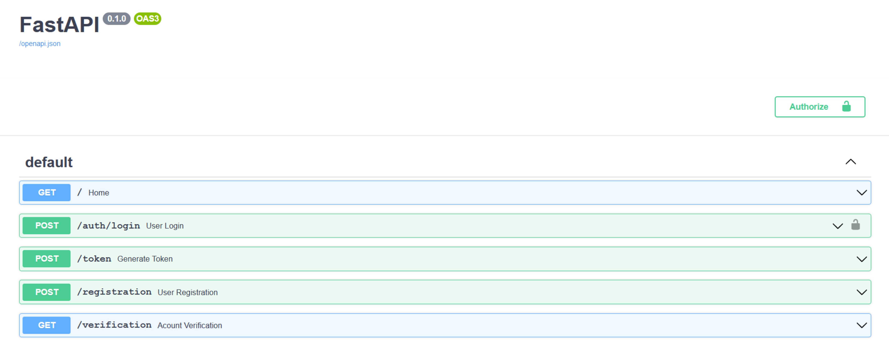

<a href="https://github.com/MohanChhabaria">Other projects can be seen here</a>

# Fast Api Authenticated Feed System

The project is a demo project for fastapi and socket.io implementation. It gives you option to register yourself as a user and login to see the details of the api. Also it alows the user to broadcast messages accross all active sockets. An example can be shown in the images.  



```
Click on the Message button to type your message.  
```



```
Type any message.
Also the go to api button allows you to visit the api.  
```


```
We can see the message is broadcasted to all the active sessions.  
```

# Visit API

The API consists of login logout functionality which is enabled by the "Authorize" button seen in the image. it allows you to register by just entering your details.  




## Setup Locally

1. Fork this repository!

2. Clone this repository and setup a remote to the original repository.

3. Make sure you are using python 3.8 and pipenv.

4.  Run the following commands:
    ```
    pipenv shell
    pipenv install -r requirements.txt
    cp .env.example .env
    ```

5. The project should now be running locally!

6. Go to the url "localhost:8000".


## Built With

* Python 
* HTML (for templating)